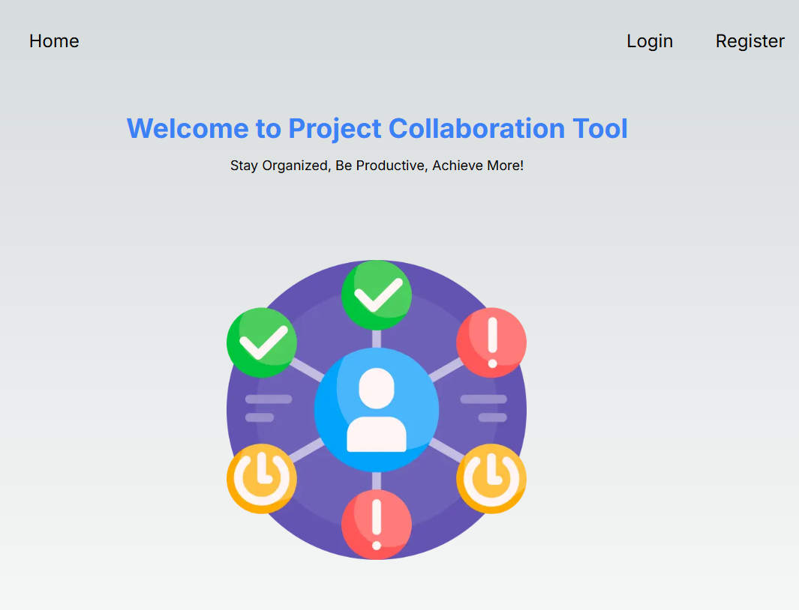

# Project README

## Overview
The **Project Collaboration Tool** is a comprehensive platform designed for seamless team coordination and task management. It integrates real-time communication features, allowing team members to efficiently manage and collaborate on projects. The tool includes project management, task tracking, and AI-generated insights for optimal project outcomes.

- **Real-Time Communication**: Using Socket.IO, the application enables instant communication, allowing team members to hold project-based meetings in real-time.
- **AI Integration**: Integrated Gemini AI API to generate actionable insights and task suggestions from project meeting notes.
- **Backend APIs**: 20+ REST APIs built with Node.js, Express.js, and MongoDB for efficient frontend-backend communication.


<!--
## Video Demonstration
This video demonstrates the successful implementation of the Task Tracker app. You can click on the thumbnail or directly access the video from this Google Drive link:
https://drive.google.com/file/d/1-zc2tc18mOBjRqcWqIgOQd2-lxm6BKFD/view?usp=sharing

[](https://drive.google.com/file/d/1-zc2tc18mOBjRqcWqIgOQd2-lxm6BKFD/view?usp=sharing)
-->

## Repo Layout

This repository is organized into the following directories and files:

**frontend/**: Contains all the frontend code for the application.
  - **node_modules/**: Contains installed dependencies.
  - **.gitignore**: Specifies files and directories ignored by Git.
  - **.env**: Stores environment variables.
  - **pages/**: Contains Next.js pages for the frontend.
  - **components/**: Holds reusable React components.
  - **public/**: Contains static assets like images or fonts.
  - **api/**: Holds API routes for the backend.
  - **utils/**: Contains utility functions used across the project.


**backend/**: Contains all the backend code for the application.
  - **server.js**: The main server file that initializes the application and connects to the MongoDB database.
  - **routes/**: Contains the route files for the various task-related endpoints.
  - **models/**: Contains the Mongoose schema for the `Task` model.
  - **tests/**: Contains all unit and integration tests for the application.

## Architecture of the Frontend Code Files

### Frontend (Next.js)
- **React Components**: Utilizes React components for building UIs, offering reusable and modular design elements.
- **Next.js**: Employs Next.js for server-side rendering to improve performance and SEO.
- **TypeScript**: Adds type safety to the application, reducing runtime errors and enhancing developer experience.
- **Pages (`frontend/src/app`)**: Contains Next.js pages that render different routes of the application. Each page corresponds to a specific URL and is represented by a React component.
- **Components (`frontend/src/components`)**: Holds reusable React components used across multiple pages, enabling code reuse and consistency.
- **API Routes (`frontend/src/app/api`)**: Contains endpoints facilitating communication between the frontend and backend.
 
# Setting Up and Running the Project
### Setting Up and Running the Frontend
To run the Frontend , follow these steps:

1. Download the entire project and navigate to frontend folder.
2. Run the following command to install all required packages:


   ```bash
   npm install

3. For frontend, make a .env file inside frontend directory and include the following in it: NEXTAUTH_URL="http://localhost:3000/" NEXTAUTH_SECRET="abcd1234"


4. Run the following command to start the frontend


   ```bash
   npm run dev

5. The server will run on http://localhost:3000.


### Setting Up and Running the Backend Server

To run the server for testing, follow these steps:

1. Ensure MongoDB is running on your local machine. The server connects to MongoDB using the URI `mongodb://localhost:27017/project3100`.
2. Start the server:
   ```bash
   node server.js

3. The server will run on http://localhost:4000.


## Running Unit Tests

To run the unit tests:

1. Navigate to the **tests/** folder:
   ```bash
   cd tests

2. Run the tests using npm:

    ```bash
    npx jest test.js

### Note you need to be in the tests folder to run the test by using npm test

All tests are working correctly and have been implemented to ensure the proper functionality of the task routes and operations.
